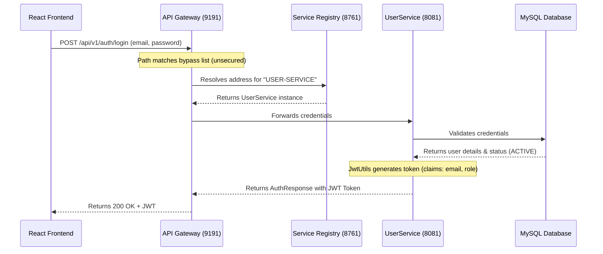
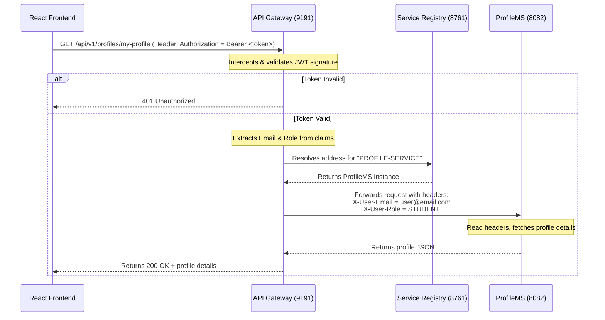
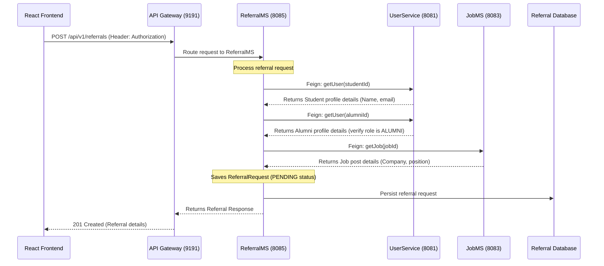

# Implementation Plan - Alumni Management System Microservices Architecture

This document establishes the architecture, directory layout, work division, and communication flows for migrating the Alumni Management System monolith to a secure, decentralized microservices system.

The design is modeled after the **Lead Architect blueprint**, providing shared infrastructure and template chassis for the team, while delegating specific feature scopes to other members.

---

## 4-Member Work Division & Roles

| Member | Role / Scope | Deliverables | Port |
| :--- | :--- | :--- | :--- |
| **Member 1 (You - Lead/Architect)** | **Infrastructure & User Core** | - Eureka Service Registry<br>- API Gateway (JWT Security & Routing)<br>- UserService (Registration, Login, JWT generation) | `8761`<br>`9191`<br>`8081` |
| **Member 2** | **Job & Application Catalog** | - JobMS (Manage job postings, details, search)<br>- ApplicationMS (Manage job applications) | `8083`<br>`8084` |
| **Member 3** | **User Profile & Communication** | - ProfileMS (Manage student & alumni profiles)<br>- MessageMS (Manage user-to-user messaging & chat history) | `8082`<br>`8086` |
| **Member 4** | **Referral & Alert Orchestrator** | - ReferralMS (Orchestrates referral requests via Feign)<br>- NotificationMS (Handles notifications/alerts for jobs/referrals) | `8085`<br>`8087` |

---

## Directory Structure (Monorepo)

To make compilation and version management clean, we use a single Git repository with a root parent `pom.xml` managing the shared dependency versions.

```
e:\alumni-management-system\
├── pom.xml                       # Central Maven Parent POM
├── ServiceRegistry\              # Netflix Eureka Server (Port 8761)
├── ApiGateway\                   # Spring Cloud Gateway with JWT Filter (Port 9191)
├── UserService\                  # Registration, login, password hashing, and token generation (Port 8081)
│
├── TemplateMS\                   # Skeletal client template with global exception handler & dependencies
│
│   <!-- Teammates will duplicate TemplateMS to create the following: -->
├── ProfileMS\                    # Profile management service (Port 8082) - Member 3
├── MessageMS\                    # Peer-to-peer messaging service (Port 8086) - Member 3
├── JobMS\                        # Job catalog service (Port 8083) - Member 2
├── ApplicationMS\                # Application tracker service (Port 8084) - Member 2
├── ReferralMS\                   # Referral orchestrator service (Port 8085) - Member 4
└── NotificationMS\               # System notifications service (Port 8087) - Member 4
```

---

## Dynamic System Flows

### Flow A: Registration & Authentication
User registers/logs in through the API Gateway, which forwards requests to `UserService` (unsecured path). `UserService` signs and returns a stateless JWT token containing their email and role.



---

### Flow B: Secure Downstream Communication
For protected routes, the API Gateway intercepts the request, validates the token, and extracts the claims (e.g., email, role). It then forwards these to the downstream service via HTTP headers (`X-User-Email`, `X-User-Role`). Downstream services do not need Spring Security configurations; they simply read the headers.



---

### Flow C: Referral Orchestration (OpenFeign)
When a student requests a referral for a job post, `ReferralMS` coordinates with other services to validate metadata using declarative OpenFeign clients.



---

## Detailed Service Requirements

### 1. Centralized Parent POM (`/pom.xml`)
- Spring Boot Starter Parent: `3.2.5`
- Spring Cloud BOM: `2023.0.1` (consistent versions)
- Shared properties: Java 17, Lombok, MySQL version.

### 2. ServiceRegistry (`/ServiceRegistry`)
- Spring Cloud Eureka Server.
- Configured to run on port `8761`.

### 3. API Gateway (`/ApiGateway`)
- Spring Cloud Gateway.
- Port: `9191`.
- Configured to register with Eureka and route to:
  - `lb://USER-SERVICE` for `/api/v1/auth/**` (Permit all in gateway validation filter).
  - `lb://PROFILE-SERVICE` for `/api/v1/profiles/**` (Require token, forward user headers).
  - `lb://JOB-SERVICE` for `/api/v1/jobs/**` (Require token, forward user headers).
  - `lb://APPLICATION-SERVICE` for `/api/v1/applications/**` (Require token, forward user headers).
  - `lb://REFERRAL-SERVICE` for `/api/v1/referrals/**` (Require token, forward user headers).
  - `lb://MESSAGE-SERVICE` for `/api/v1/messages/**` (Require token, forward user headers).
  - `lb://NOTIFICATION-SERVICE` for `/api/v1/notifications/**` (Require token, forward user headers).
- **AuthenticationFilter**: A reactive gateway filter checks for the Bearer token, validates it against `JwtUtils`, parses the claims, and adds them to request headers.

### 4. UserService (`/UserService`)
- Core DB access module containing the `users` table.
- Port: `8081`.
- Exposes:
  - `POST /api/v1/auth/register` (hashes passwords using BCrypt, saves user with dynamic status: Alumni -> PENDING, Student/Admin -> ACTIVE).
  - `POST /api/v1/auth/login` (checks password, returns JWT).
  - `GET /api/v1/auth/users/{id}` (fetching user roles/metadata for Feign clients).

### 5. TemplateMS (`/TemplateMS`)
- Port: `8088` (default template port).
- A clean template service containing:
  - JPA, Web, Lombok, MySQL, and ModelMapper dependencies.
  - `@RestControllerAdvice` handling validation, mapping, and database exceptions.
  - A sample controller that demonstrates how to read `X-User-Email` and `X-User-Role` from headers injected by the Gateway.
  - Configured as a Eureka Client.

---

## Verification Plan

### Automated Compilation
- Run `mvn clean package -DskipTests` from the root directory to verify parent-child compilation.

### Running & Testing Services
1. Run `ServiceRegistry` and view the dashboard at `http://localhost:8761`.
2. Run `UserService`, `ApiGateway` and verify both appear in the dashboard.
3. Test signup & login:
   - Call `POST http://localhost:9191/api/v1/auth/register`
   - Call `POST http://localhost:9191/api/v1/auth/login` and extract the token.
4. Test Gateway validation by accessing a protected route in a downstream service using the token.
