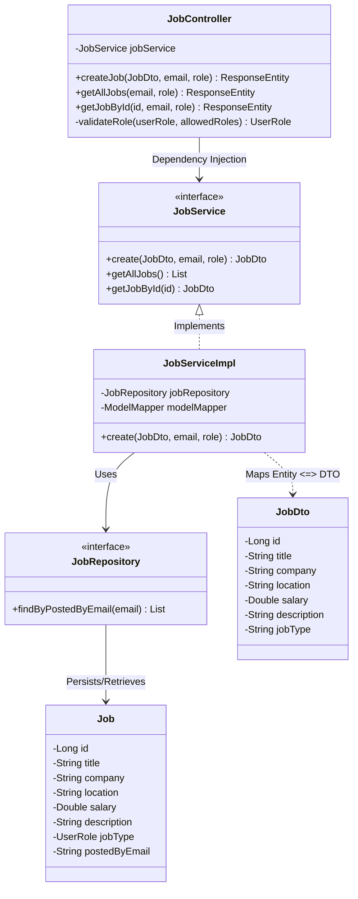
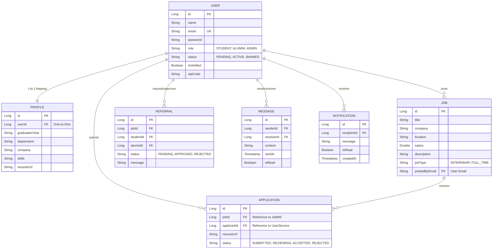
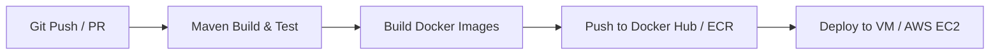

# Alumni Management System (AMS) - Placement Interview Guide

This guide provides comprehensive answers to common placement and technical interview questions based on the **Alumni Management System (AMS)** architecture. It integrates the active Spring Boot (Java) implementation, along with the planned polyglot subsystems: the **ASP.NET Core (.NET 8) Notification Service** (Steeltoe) and the **Python FastAPI AI Service** (LangChain, RAG chatbot, automated job creator).

---

## Table of Contents
1. [C-DAC Project Overview & System Block Diagram](#1-c-dac-project-overview--system-block-diagram)
2. [OOPs Concepts Implementation](#2-oops-concepts-implementation)
3. [System Diagrams (Use-Case, Class, ER)](#3-system-diagrams-use-case-class-er)
4. [N-Tier Architecture Details](#4-n-tier-architecture-details)
5. [Advanced Features Used](#5-advanced-features-used)
6. [Role and Contributions](#6-role-and-contributions)
7. [Software Development Methodology (Agile Scrum)](#7-software-development-methodology-agile-scrum)
8. [Design Patterns Implemented](#8-design-patterns-implemented)
9. [Difficulties Faced & Solutions](#9-difficulties-faced--solutions)
10. [Database Design & Rationale](#10-database-design--rationale)
11. [Data Access Layer (Repository Layer with Code)](#11-data-access-layer-repository-layer-with-code)
12. [AJAX Implementation (Axios & Interceptors)](#12-ajax-implementation-axios--interceptors)
13. [Frontend Technology Stack](#13-frontend-technology-stack)
14. [Configuration Files Explanation](#14-configuration-files-explanation)
15. [Security Implementation Detail](#15-security-implementation-detail)
16. [CI/CD Pipeline Setup Roadmap](#16-cicd-pipeline-setup-roadmap)
17. [Separation of Concerns (SoC)](#17-separation-of-concerns-soc)
18. [Session Management Implementation](#18-session-management-implementation)
19. [Authentication vs. Authorization](#19-authentication-vs-authorization)
20. [Authentication Flow & JWT Mechanics](#20-authentication-flow--jwt-mechanics)
21. [Authorization Flow & Role-Based Access Code](#21-authorization-flow--role-based-access-code)
22. [Hosting & Online Deployment Guide](#22-hosting--online-deployment-guide)
23. [DNS Resolution & Network Request Life Cycle](#23-dns-resolution--network-request-life-cycle)
24. [Scaling Strategies (Horizontal/Vertical)](#24-scaling-strategies-horizontalvertical)
25. [Microservices Rationale & Implementation Summary](#25-microservices-rationale--implementation-summary)

---

## 1. C-DAC Project Overview & System Block Diagram

### Project Description
The **Alumni Management System (AMS)** is a secure, polyglot microservices platform designed to bridge the gap between students and college alumni. It facilitates job discovery, referral requests, career guidance, and peer-to-peer message exchanges. 

The architecture leverages a hybrid backend to optimize specific workloads:
*   **Java (Spring Boot):** Core enterprise business logic (Users, Profiles, Jobs, Applications, Referrals, Messages) requiring strong transactional guarantees.
*   **C# (.NET 8 + Steeltoe):** High-throughput asynchronous Notification Subsystem.
*   **Python (FastAPI + LangChain):** AI microservice orchestrating a career advisor chatbot using Retrieval-Augmented Generation (RAG) and an automated job posting creator.
*   **Service Mesh & Security:** Managed via Netflix Eureka Service Registry and Spring Cloud API Gateway with custom edge JWT authentication.

### Core System Block Diagram
```mermaid
graph TD
    Client[React Frontend - Vite] -->|Port 9191| Gateway[Spring Cloud API Gateway]
    Gateway -->|Verify Token & Fetch Route| Registry[Netflix Eureka Service Registry :8761]
    
    subgraph Microservices Cluster
        Gateway -->|Route /api/v1/auth| UserService[UserService :8081]
        Gateway -->|Route /api/v1/profiles| ProfileMS[ProfileMS :8082]
        Gateway -->|Route /api/v1/jobs| JobMS[JobMS :8083]
        Gateway -->|Route /api/v1/applications| ApplicationMS[ApplicationMS :8084]
        Gateway -->|Route /api/v1/referrals| ReferralMS[ReferralMS :8085]
        Gateway -->|Route /api/v1/messages| MessageMS[MessageMS :8086]
        Gateway -->|Route /api/v1/notifications| NotificationMS[.NET 8 / Java :8087]
        Gateway -->|Route /api/v1/ai| AIService[Python FastAPI AI :8000]
    end
    
    subgraph Inter-Service Comms
        ReferralMS -->|Feign Client| UserService
        ReferralMS -->|Feign Client| NotificationMS
        ApplicationMS -->|Feign Client| JobMS
        AIService -->|HTTP REST| JobMS
        AIService -->|HTTP REST| ProfileMS
    end

    subgraph Persistence Layer (Database-per-Service)
        UserService -->|MySQL| DB_User[(user_db)]
        ProfileMS -->|MySQL| DB_Profile[(profile_db)]
        JobMS -->|MySQL| DB_Job[(job_db)]
        ApplicationMS -->|MySQL| DB_App[(application_db)]
        ReferralMS -->|MySQL| DB_Ref[(referral_db)]
        MessageMS -->|MySQL| DB_Msg[(message_db)]
        NotificationMS -->|MySQL| DB_Notif[(notification_db)]
        AIService -->|Vector DB| ChromaDB[(Chroma VectorDB)]
    end

    style Gateway fill:#f9f,stroke:#333,stroke-width:2px
    style Registry fill:#bbf,stroke:#333,stroke-width:2px
    style AIService fill:#bfb,stroke:#333,stroke-width:2px
    style NotificationMS fill:#fbb,stroke:#333,stroke-width:2px
```

---

## 2. OOPs Concepts Implementation

Object-Oriented Programming (OOP) forms the core foundation of our backend design. Here is how the four major pillars are implemented:

*   **Encapsulation:** 
    *   Data and operations are wrapped in classes. Entities (e.g., `User`, `Job`, `Profile`) use private fields, exposing them via public getter/setter methods (automated via Lombok annotations like `@Getter`, `@Setter`, `@Data`).
    *   **Data Transfer Objects (DTOs)** like `RegisterRequest` and `JobDto` encapsulate the payload structure transferred over HTTP, shielding database entities from direct API exposure.
*   **Inheritance:**
    *   API Gateway's custom authentication filter inherits from Spring Cloud's base filter template: `public class AuthenticationFilter extends AbstractGatewayFilterFactory<AuthenticationFilter.Config>`.
    *   Data repositories inherit standard database operations by extending Spring Data JPA's repository interface: `public interface UserRepository extends JpaRepository<User, Long>`.
*   **Polymorphism:**
    *   **Method Overloading:** Used across service classes (e.g., standard find methods with different parameters).
    *   **Interface Implementation:** We declare interfaces like `JobService` and implement them in classes like `JobServiceImpl`. This allows us to change implementations dynamically (e.g., swapping a mock service with a real database service) without modifying client code.
*   **Abstraction:**
    *   We use interface contracts to separate implementation details from usage. 
    *   For example, **OpenFeign Clients** use interface definitions to describe inter-service calls:
        ```java
        @FeignClient(name = "JOB-SERVICE")
        public interface JobServiceClient {
            @GetMapping("/api/v1/jobs/{id}")
            JobDto getJobById(@PathVariable("id") Long id, @RequestHeader("X-User-Role") String role);
        }
        ```
        The actual client implementation is abstract to the developer; Spring generates the runtime implementation dynamically.

---

## 3. System Diagrams (Use-Case, Class, ER)

### A. Use-Case Diagram
```mermaid
leftToRightDirection
gc / "Alumni Management System Use Cases"
package Actors {
    actor Student
    actor Alumni
    actor Admin
}

package "Core System Use Cases" {
    usecase "Register & Verify OTP" as UC1
    usecase "Manage Profile" as UC2
    usecase "Post Job Openings" as UC3
    usecase "Apply for Jobs" as UC4
    usecase "Request Job Referral" as UC5
    usecase "Approve Referral Request" as UC6
    usecase "Chat / Send Messages" as UC7
    usecase "Interact with Career Chatbot (RAG)" as UC8
    usecase "Generate Auto Job Description" as UC9
    usecase "Approve/Reject Pending Alumni" as UC10
}

Student --> UC1
Student --> UC2
Student --> UC4
Student --> UC5
Student --> UC7
Student --> UC8

Alumni --> UC1
Alumni --> UC2
Alumni --> UC3
Alumni --> UC6
Alumni --> UC7
Alumni --> UC9

Admin --> UC10
Admin --> UC2
```

### B. Class Diagram (Structure of a Microservice)
Using the **Job Microservice** as a structural representation:


### C. Entity-Relationship (ER) Diagram (Logical View)
Although split across microservices, the logical ER diagram mappings are as follows:



---

## 4. N-Tier Architecture Details

The system follows a distributed **N-tier architecture**, which splits responsibilities horizontally across layers:

```
┌────────────────────────────────────────────────────────┐
│ 1. Presentation Tier (React SPA Client - Axios)        │
└───────────────────────────┬────────────────────────────┘
                            ▼ [HTTP / JSON]
┌────────────────────────────────────────────────────────┐
│ 2. Edge / Gateway Tier (Spring Cloud API Gateway)      │
└───────────────────────────┬────────────────────────────┘
                            ▼ [Routing via Eureka Registry]
┌────────────────────────────────────────────────────────┐
│ 3. Controller / API Tier (Spring RestControllers)      │
└───────────────────────────┬────────────────────────────┘
                            ▼ [DTO to Entity Mapping]
┌────────────────────────────────────────────────────────┐
│ 4. Service / Business Tier (Business Logic & Feign)    │
└───────────────────────────┬────────────────────────────┘
                            ▼ [Spring Data JPA / ORM]
┌────────────────────────────────────────────────────────┐
│ 5. Data Access / Repository Tier (Repositories)        │
└───────────────────────────┬────────────────────────────┘
                            ▼ [JDBC Driver]
┌────────────────────────────────────────────────────────┐
│ 6. Persistence Tier (MySQL Databases)                  │
└────────────────────────────────────────────────────────┘
```

1.  **Presentation Tier:** React SPA running in the browser. Handles UI view logic, localized session storage, and asynchronously makes HTTP calls using Axios (AJAX).
2.  **Edge / Gateway Tier:** Spring Cloud API Gateway acts as the gateway entry. Intercepts calls, checks credentials via custom security filters, and directs requests downstream.
3.  **Controller / API Tier:** Controller classes (e.g., `ProfileController`) handle HTTP requests, validate query fields via Hibernate Validation (`@Valid`), and formulate response codes (`HttpStatus.OK`, `HttpStatus.CREATED`).
4.  **Service / Business Logic Tier:** Focuses on business policies. Validates permissions, calculates similarity, schedules tasks, and accesses other microservices using OpenFeign interface configurations.
5.  **Data Access / Repository Tier:** Managed by Spring Data JPA. Generates SQL queries dynamically from method names and maps table rows to Java entities.
6.  **Persistence Tier:** Database-per-service isolation schemas run inside isolated MySQL server containers.

---

## 5. Advanced Features Used

*   **Polyglot Microservices:** Integrated Spring Boot (for robust transaction security), .NET 8 (for low-latency socket networking in notifications), and Python FastAPI (for native data science libraries).
*   **Netflix Eureka Discovery Mesh:** Centralized directory service preventing hardcoded configurations; allows seamless microservice auto-scaling.
*   **Edge-Level Decoupled Token Security:** The gateway parses the cryptographically signed JWT. Downstream microservices receive clean headers (`X-User-Id`, `X-User-Role`), stripping away duplicate security libraries and reducing processing latency.
*   **AI Retrieval-Augmented Generation (RAG):** The Python FastAPI microservice pulls active job records, converts them into numeric embeddings using OpenAI/Gemini APIs, stores them in ChromaDB, and runs similarity operations to matching queries.
*   **LangChain Automated Job Creator:** Empowers alumni to quickly draft professional job descriptions by prompting an LLM using structural design models.
*   **Steeltoe Mesh Integration:** Meshes .NET 8 runtime services directly with Netflix Eureka without needing dedicated middleware.
*   **SMTP Mail Alerts with OTP:** Protects the platform from spam by requiring 6-digit random one-time-passcode verifications on registration.

---

## 6. Role and Contributions

**Role: Full-Stack Developer & Systems Architect**

### Key Accomplishments:
*   Configured the root **Maven parent POM** to coordinate builds, dependencies, and cloud profiles across all Spring Boot modules.
*   Wrote the **API Gateway custom JWT authentication filter** (`AuthenticationFilter.java`), enabling token-free downstream business logic.
*   Engineered database-per-service isolation structures using distinct MySQL container ports and configured dynamic connection fallbacks.
*   Developed core microservice features (Job submissions, user profile rules, dynamic application routing, and inter-service client mappings using OpenFeign).
*   Created the **React client interface** with Vite, integrating request/response axios interceptors to automatically secure authorization tokens.
*   Wrote **Dockerfiles** for the microservices and tied the platform together using a declarative **Docker Compose configuration** with network bridging and container startup healthchecks.

---

## 7. Software Development Methodology (Agile Scrum)

We used the **Agile Scrum Methodology** to plan and execute the project.

### Process Phases:
1.  **Requirement Gathering & Product Backlog:** Requirements were translated into functional user stories (e.g., *"As a student, I want to request a referral from an alumnus for a job listing..."*).
2.  **Sprint Planning:** Work was divided into 2-week iterations (Sprints). We assigned story points based on task complexity.
3.  **Daily Standups:** Held brief syncs to outline:
    *   What did I accomplish yesterday?
    *   What will I do today?
    *   Are there any blockers?
4.  **Incremental Releases:** At the end of each sprint, a working service was demonstrated (e.g., Sprint 1: UserService + ServiceRegistry, Sprint 2: ProfileMS + Gateway, Sprint 3: JobMS + OpenFeign integrations).
5.  **Sprint Review & Retrospective:** Evaluated the performance of completed sprints to fix workflow bottlenecks.

---

## 8. Design Patterns Implemented

*   **API Gateway Pattern:** Unified edge entry point (`ApiGateway` on port 9191) to prevent exposing internal service topologies.
*   **Service Discovery / Registry Pattern:** Centralized service directory (`ServiceRegistry` using Netflix Eureka) enabling dynamic address resolution.
*   **Database-per-Service Pattern:** Isolated datastores to decouple microservice domains and eliminate database bottlenecks.
*   **Dependency Injection (DI) / Inversion of Control (IoC):** Used heavily in Spring (`@Autowired`) and .NET Core (`builder.Services.AddDiscoveryClient`). Decouples component construction from usage.
*   **Factory Pattern:** Implemented in `AuthenticationFilter` extending `AbstractGatewayFilterFactory` to construct route-specific gateway filters dynamically.
*   **Builder Pattern:** Implemented via Lombok's `@Builder` annotation on entities and DTOs to instantiate objects with clean, readable chain methods:
    ```java
    UserDto dto = UserDto.builder().id(user.getId()).email(user.getEmail()).role(user.getRole()).build();
    ```
*   **Data Transfer Object (DTO) Pattern:** Decouples API contract presentation layers from internal database persistence logic.
*   **Interceptor Pattern:** Implemented in Axios requests to transparently inject authentication details and intercept error codes.

---

## 9. Difficulties Faced & Solutions

### A. Dynamic Networking & Dynamic Ports
*   **Problem:** Microservices run on separate IP addresses or dynamic ports inside containers, making hardcoded connection URLs unreliable.
*   **Solution:** Implemented **Netflix Eureka Service Registry**. Services register themselves dynamically by application name (e.g., `JOB-SERVICE`), and downstream callers resolve address locations automatically.

### B. Security Redundancy & Configuration Overhead
*   **Problem:** Configuring Spring Security, token filters, and secret decryption keys inside every microservice resulted in significant code duplication and higher CPU usage.
*   **Solution:** Implemented **Edge Authentication**. The `ApiGateway` performs all token verification. Downstream microservices trust gateway authorization, reading user metadata directly from injected HTTP headers (`X-User-Id`, `X-User-Role`).

### C. Database Connection Failures During Container Startup
*   **Problem:** Downstream microservices boot faster than the MySQL database container, causing connection failures and startup crashes.
*   **Solution:** Configured **Docker Compose Healthchecks**. We added a health check to the database container running `mysqladmin ping`. Microservices specify `depends_on: alumni-db: condition: service_healthy` to wait for database readiness before starting.

### D. CORS (Cross-Origin Resource Sharing) Failures
*   **Problem:** The React client (port 5173) was blocked by the browser when making calls to the API Gateway (port 9191) due to strict cross-origin policies.
*   **Solution:** Configured a global CORS mapping in the API Gateway's `application.properties`:
    ```properties
    spring.cloud.gateway.globalcors.cors-configurations.[/**].allowedOriginPatterns=*
    spring.cloud.gateway.globalcors.cors-configurations.[/**].allowedMethods=*
    spring.cloud.gateway.globalcors.cors-configurations.[/**].allowCredentials=true
    ```

---

## 10. Database Design & Rationale

We selected **MySQL (version 8.0)** as the core database engine.

### Rationale:
*   **ACID Compliance:** Essential for handling transactions securely (e.g., submitting job applications, approving referrals, and managing user access states).
*   **Structured Schemas:** Clear relationships between users, profiles, and listings benefit from relational modeling.
*   **Low Resource Footprint:** Standard relational databases run efficiently in lightweight containers.

### Database Architecture: Database-per-Service
To avoid tight coupling, each microservice has its own isolated database instance or schema:
*   **`user_db`:** User authentication, password hashes, and OTP records.
*   **`profile_db`:** Profile details, skills, and resume paths.
*   **`job_db`:** Job details, compensation ranges, and listing locations.
*   **`application_db`:** Application states, timestamps, and upload details.
*   **`referral_db`:** Referral request details and approval notes.
*   **`message_db`:** Direct chat history and thread read states.

Because they are isolated, services can scale their databases independently (e.g., migrating `message_db` to MongoDB for high-write chat logging without affecting other services).

---

## 11. Explain the Data Access Layer of Your Database with Code

Our data access layer is built using **Spring Data JPA** with **Hibernate** acting as the Object-Relational Mapper (ORM). 

We create repository interfaces that extend `JpaRepository<Entity, IdType>`. Spring Data JPA generates database access queries automatically from our method names.

### UserRepository Example File:
```java
package com.alumniconnect.userservice.repository;

import com.alumniconnect.userservice.entity.User;
import org.springframework.data.jpa.repository.JpaRepository;
import org.springframework.stereotype.Repository;
import java.util.Optional;

@Repository
public interface UserRepository extends JpaRepository<User, Long> {
    
    // Custom query generated automatically by JPA parsing the method name
    Optional<User> findByEmail(String email);
    
    // Generates an optimized SQL EXISTS query
    boolean existsByEmail(String email);
}
```

### Usage in Service Layer:
```java
@Service
public class AuthServiceImpl implements AuthService {

    @Autowired
    private UserRepository userRepository;

    public UserDto register(RegisterRequest request) {
        if (userRepository.existsByEmail(request.getEmail())) {
            throw new RuntimeException("Email is already registered!");
        }
        User user = new User();
        user.setEmail(request.getEmail());
        user.setPassword(passwordEncoder.encode(request.getPassword())); // BCrypt
        User savedUser = userRepository.save(user); // SQL INSERT
        return mapToDto(savedUser);
    }
}
```

---

## 12. Have You Used AJAX in Your Project? How?

Yes, **AJAX (Asynchronous JavaScript and XML)** is used to perform non-blocking HTTP requests. This allows the user interface to load and submit data dynamically without refreshing the page.

We use **Axios** to handle HTTP calls inside our React client.

### Client API Setup Example (`api.js`):
```javascript
import axios from 'axios';

const api = axios.create({
  baseURL: 'http://localhost:9191', // Routing requests through the API Gateway
  headers: {
    'Content-Type': 'application/json',
  },
});

// Axios Request Interceptor: Automatically appends the JWT bearer token
api.interceptors.request.use(
  (config) => {
    const user = JSON.parse(localStorage.getItem('currentUser'));
    if (user && user.token) {
      config.headers['Authorization'] = `Bearer ${user.token}`;
    }
    return config;
  },
  (error) => Promise.reject(error)
);

// Asynchronous AJAX call using async/await
export const jobs = {
  create: async (jobData) => {
    // Non-blocking POST request to the Gateway
    const response = await api.post('/api/v1/jobs', jobData);
    return response.data; // Dynamic update returned to the UI component
  }
};
```

---

## 13. Which Frontend Technology is Used in Your Project?

*   **Vite + React (JavaScript):** The user interface is built as a single-page application (SPA). Vite provides faster local development builds compared to traditional Create React App configurations.
*   **Axios:** Handles asynchronous API requests, token routing, and centralized error handling.
*   **Vanilla CSS:** Implements responsive layouts and custom component styles without external framework dependencies.
*   **Local Storage:** Stores the user session JWT token, user name, role, and ID to maintain state across pages.

---

## 14. Explain Configuration Files Used in Your Project

### A. Root `pom.xml` (Maven Parent POM)
Manages dependencies, sets Java 17 runtimes, and declares the unified `Spring Cloud` build version (`2023.0.1`) to ensure compatibility across all microservices.

### B. Microservice `application.properties`
Located inside each microservice's `src/main/resources/` directory. Example configurations:
*   `server.port`: Specifies the service port (e.g., `8081` for `UserService`).
*   `spring.application.name`: Registers the name used by Eureka (e.g., `JOB-SERVICE`).
*   `spring.datasource.url`: The database connection URL.
*   `eureka.client.serviceUrl.defaultZone`: The location of the Eureka registry server.

### C. Root `docker-compose.yml`
Defines configuration properties for container orchestration, including database initialization environments, shared virtual networks, mapping ports, and container startup ordering.

### D. C# `appsettings.json` (Planned .NET Service)
Controls parameters for the .NET service, including database connections and Eureka service registration configurations:
```json
{
  "Eureka": {
    "Client": {
      "ServiceUrl": "http://service-registry:8761/eureka/",
      "ShouldRegisterWithEureka": true
    },
    "Instance": {
      "AppName": "NOTIFICATION-SERVICE"
    }
  }
}
```

---

## 15. Explain Security Implementation of Your Project

We use a **stateless, edge-security model** designed for microservice architectures.

```
[ Client ] ──( 1. Sends JWT in Header )──> [ API Gateway ]
                                                │
                                    ( 2. Verifies Signature )
                                                │
                                                ▼
[ Microservice Controller ] <──( 3. Injects user/role headers )─┘
```

1.  **Password Security:** Passwords are never stored as plain text. The `UserService` uses **BCrypt hashing** to encrypt passwords securely before they are saved to the database.
2.  **Edge Verification:** The `ApiGateway` intercepts all requests. It bypasses auth verification for public endpoints (`/api/v1/auth/**`) and validates the JWT signature for secured endpoints using a shared secret key.
3.  **Claims Propagation:** If the signature is verified, the gateway extracts the payload details (`userId`, `email`, `role`) and forwards them downstream as custom HTTP headers (`X-User-Id`, `X-User-Email`, `X-User-Role`).
4.  **Internal Validation:** Individual microservices read these headers to authorize requests locally, eliminating duplicate token validation code.

---

## 16. How to Build a CI/CD Pipeline for the Project

We can configure a CI/CD pipeline using **GitHub Actions**. The pipeline automated build, test, and container deployment workflows.



### CI/CD Workflow Stages:
1.  **Trigger Event:** A code push or pull request to the `main` branch.
2.  **Continuous Integration (Build & Test):**
    *   Set up Java 17 and Maven.
    *   Build the application: `mvn clean package -DskipTests` (tests can be enabled once mock testing is configured).
3.  **Containerization:**
    *   Build Docker images for each service using local Dockerfiles.
    *   Tag images with the build version and git commit hash:
        ```bash
        docker build -t myregistry/job-service:latest ./JobMS
        ```
4.  **Publishing:**
    *   Log in to a container registry (Docker Hub or Amazon ECR).
    *   Push the tagged Docker images.
5.  **Continuous Deployment (CD):**
    *   Connect to the target host (e.g., AWS EC2 instance) over SSH.
    *   Pull the latest images from the registry.
    *   Run `docker-compose up -d` to deploy the updated services.

---

## 17. Are You Aware of Separation of Concerns (SoC) in Designing an Application?

Yes. **Separation of Concerns (SoC)** is a design principle that splits an application into distinct features, where each section addresses a separate concern.

### Implementation in Our Project:
*   **System Architecture (Microservices):** Each microservice has a single, dedicated responsibility. For example, `JobMS` manages job listings, while `MessageMS` handles chat history. Each service runs independently.
*   **Data Isolation (Database-per-Service):** Services cannot access each other's databases directly. All data access must go through the service's public API.
*   **Service Layer Separation (N-Tier Model):**
    *   `Entity`: Maps to database tables.
    *   `Repository`: Handles database queries.
    *   `Service`: Contains core business logic.
    *   `Controller`: Exposes API routes and maps payloads.
*   **Security Decoupling:** The API Gateway handles authentication, freeing downstream microservices to focus entirely on business logic.

---

## 18. How Did You Implement Session Management in Your Project?

We use **stateless session management** powered by **JWT (JSON Web Tokens)**.

```
Client                             API Gateway                      UserService
  │                                     │                                │
  ├───────── 1. Login (/login) ────────>├─────────── Forward ───────────>│
  │                                     │                                │ (Validates DB)
  │<──────── 2. Return JWT ─────────────┼─────────── Forward ────────────┤ (Generates Token)
  │                                     │                                │
  │ (Stores Token in localStorage)      │                                │
  │                                     │                                │
  ├───────── 3. Request /jobs ─────────>│                                │
  │          [Auth: Bearer JWT]         │ (Validates JWT)                │
  │                                     │─── 4. Injects Headers ────────>│ (Processes API)
```

1.  **Stateless Design:** The backend server does not store user session states in memory. This eliminates the need to coordinate session data across servers.
2.  **Token Storage:** Upon login, the client receives a JWT and saves it to local browser storage (`localStorage.setItem('currentUser', ...)`).
3.  **Authentication Interception:** The client appends the token to the `Authorization` header of all subsequent API requests.
4.  **Decoupling Session States:** The API Gateway validates tokens on incoming requests. If a token expires or is modified, the gateway returns an HTTP `401 Unauthorized` status. The React app detects this code and redirects the user to the login screen.

---

## 19. What is the Difference Between Authentication and Authorization?

| Aspect | Authentication (AuthN) | Authorization (AuthZ) |
| :--- | :--- | :--- |
| **Core Question** | *"Who are you?"* | *"What are you allowed to do?"* |
| **Validation Point** | Verifies the identity of a user. | Verifies the permissions of a user. |
| **Typical Credentials**| Email, Password, OTP, Social Login. | User Roles (e.g., `STUDENT`, `ALUMNI`, `ADMIN`). |
| **First Action** | Happens first upon login. | Happens after authentication is verified. |
| **Project Example** | Entering credentials on the login page; getting back a verified JWT token. | Blocking a `STUDENT` from deleting a job listing posted by an `ALUMNI`. |

---

## 20. Explain the Authentication Flow of Your Project

Our authentication flow uses **JWTs** to manage stateless user sessions.

### Step-by-Step Flow:
1.  **Registration & Verification:** 
    *   A user submits registration details. The `UserService` generates a 6-digit verification code (OTP) and sends it to the user's email using JavaMailSender.
    *   The user submits the code to the `/verify-otp` endpoint to activate their account.
2.  **Credentials Validation:** 
    *   The user logs in with their email and password at the `/login` endpoint.
    *   `UserService` retrieves the user entity from the database and verifies the password using BCrypt.
3.  **Generating Tokens:** 
    *   If valid, the service creates a JWT token containing claims (User ID, Email, Role) and signs it using a secret key:
        ```java
        String token = Jwts.builder()
            .setSubject(user.getEmail())
            .claim("userId", user.getId())
            .claim("role", user.getRole().name())
            .setIssuedAt(new Date())
            .setExpiration(new Date(System.currentTimeMillis() + jwtExpirationMs))
            .signWith(SignatureAlgorithm.HS256, secretKey)
            .compact();
        ```
4.  **Client-Side Handshake:** 
    *   The client receives the token and stores it in `localStorage`. The token is appended to the headers of subsequent requests to authenticate the user.

---

## 21. How Authorization is Implemented in Your Project

Authorization is implemented by verifying role headers downstream from the API Gateway.

### User Roles:
*   `STUDENT`: Can view job postings, update their profile, request referrals, and chat with alumni.
*   `ALUMNI`: Can post jobs, review referral requests, and update their profile.
*   `ADMIN`: Full access to update user accounts, delete job postings, and manage user roles.

### Authorization Workflow:
1.  The API Gateway extracts user roles from the JWT claims payload and adds it to the HTTP request headers as `X-User-Role`.
2.  Downstream microservices read this header and authorize actions locally using validation helpers.

### Code Implementation (`JobController.java`):
```java
// Endpoint to create a new job posting
@PostMapping
public ResponseEntity<JobDto> createJob(
        @Valid @RequestBody JobDto jobDto,
        @RequestHeader(value = "X-User-Email", required = false) String userEmail,
        @RequestHeader(value = "X-User-Role", required = false) String userRole) {
    
    // Only ALUMNI or ADMIN can create job postings
    UserRole validateRole = validateRole(userRole, UserRole.ALUMNI, UserRole.ADMIN);
    JobDto createdJob = jobService.create(jobDto, userEmail, validateRole);
    return new ResponseEntity<>(createdJob, HttpStatus.CREATED);
}

// Role Validation Helper Function
private UserRole validateRole(String userRoleStr, UserRole... allowedRoles) {
    if (userRoleStr == null) {
        throw new RuntimeException("Access denied: User role header is missing");
    }
    UserRole userRole;
    try {
        userRole = UserRole.fromString(userRoleStr);
    } catch (IllegalArgumentException e) {
        throw new RuntimeException("Access denied: Unauthorized role: " + userRoleStr);
    }
    for (UserRole allowedRole : allowedRoles) {
        if (userRole == allowedRole) {
            return userRole;
        }
    }
    throw new RuntimeException("Access denied: Unauthorized role: " + userRoleStr);
}
```

---

## 22. How to Host an Application Online

Here is the deployment process for hosting a microservices application online using a cloud provider like **AWS**:

### A. Publish Docker Images
Build and push images for each microservice to a container registry like Docker Hub or Amazon Elastic Container Registry (ECR):
```bash
docker build -t username/user-service:latest ./UserService
docker push username/user-service:latest
```

### B. Provision Infrastructure (AWS EC2)
1.  Launch a virtual machine (EC2 instance) using a Linux AMI (e.g., Ubuntu).
2.  Configure a Security Group to open target ports:
    *   `80` (HTTP) & `443` (HTTPS)
    *   `9191` (API Gateway public port)
3.  Install Docker and Docker Compose on the virtual machine.

### C. Deploy Services
1.  Copy the project's `docker-compose.yml` configuration file to the virtual machine.
2.  Deploy the environment:
    ```bash
    docker-compose up -d --build
    ```
3.  Set up **Nginx** as a reverse proxy on the host to forward web traffic from port 80 to the React frontend (running in a container) and the API Gateway (port 9191).
4.  Configure an SSL certificate using **Let's Encrypt Certbot** to secure connections over HTTPS.

---

## 23. DNS Resolution & Network Request Life Cycle

When a user visits `www.google.co.in`, the request goes through the following resolution steps before connecting to Google's servers:

```
[ Browser ] ──( www.google.co.in )──> [ Local DNS Resolver ] ──> [ Root Server ]
    │                                            │                     │
    │                                      (Returns TLD IP) <──────────┘
    │                                            │
    │                                            ▼
    │                                     [ .in Nameserver ] ──> [ Authoritative Server ]
    │                                            │                     │
    │                                      (Returns Google IP) <───────┘
    │                                            │
    ▼                                            ▼
[ Connects to Google Server ] <───────────( Sends Target IP )
```

1.  **Local Cache Check:** The browser checks local caches (Browser Cache, OS Cache, Router Cache, Hosts File) to see if the IP address is already resolved.
2.  **Recursive DNS Lookup:** If not cached, the query is sent to a Recursive Resolver (usually provided by your ISP or a public resolver like Google DNS `8.8.8.8`).
3.  **Root Server Query:** The resolver forwards the query to a Root Nameserver (`.`), which redirects the resolver to the Top-Level Domain (TLD) Nameserver handling `.in` requests.
4.  **TLD Server Query:** The `.in` nameserver redirects the resolver to Google's Authoritative Nameservers.
5.  **Authoritative Nameserver Query:** Google's nameservers return the target IP address to the recursive resolver, which forwards it to the browser.
6.  **Handshake Connection:** The browser opens a connection to Google's servers at the returned IP address:
    *   Performs a **TCP 3-way handshake** (SYN, SYN-ACK, ACK).
    *   Establishes encryption keys via a **TLS handshake**.
7.  **HTTP Transfer:** The browser sends an HTTP request, and the server returns the homepage files (HTML, CSS, JS).

---

## 24. Scaling Strategies

To scale a microservices application to support high user volumes, we can apply two main strategies:

### A. Vertical Scaling (Scaling Up)
*   **Description:** Increasing the resources (CPU, RAM, Storage) of existing host servers.
*   **Pros:** Fast setup; requires no changes to application architecture.
*   **Cons:** Hard hardware limits; introduces single points of failure.

### B. Horizontal Scaling (Scaling Out)
*   **Description:** Adding more virtual machines to run duplicate instances of our microservices.
*   **Strategies in AMS:**
    1.  **Stateless Instances:** Because microservices run stateless sessions using JWT, we can spin up multiple instances of `JobMS` or `ProfileMS` across servers without session conflicts.
    2.  **Load Balancing:** The API Gateway balances traffic dynamically across registered microservice instances.
    3.  **Database Scaling:**
        *   **Read/Write Split:** Send write queries to a primary database instance, and distribute read queries across secondary read-replicas.
        *   **Caching:** Use **Redis** to cache frequently read, slow-moving data (like active job listings) to reduce database queries.

---

## 25. Microservices Rationale & Implementation Summary

A microservices architecture was chosen over a monolith to meet several design goals:

### Key Advantages:
*   **Technological Flexibility (Polyglot Stack):** We can select the best language for each workload: Spring Boot (Java) for enterprise security, .NET Core for notification performance, and FastAPI (Python) for AI model execution.
*   **Independent Deployments:** Teams can build, test, and release updates to `JobMS` without rebuilding or redeploying the entire system.
*   **Fault Isolation:** If the `AIService` chatbot crashes due to memory limits, other core systems like user authentication and job applications continue to function normally.
*   **Resource Alignment:** We can assign high-performance CPU instances specifically to compute-heavy services (like Python AI processing) while running simpler services on standard VMs, optimizing cloud costs.
*   **Database Autonomy:** Isolated databases eliminate single database bottlenecks and simplify domain boundaries.
